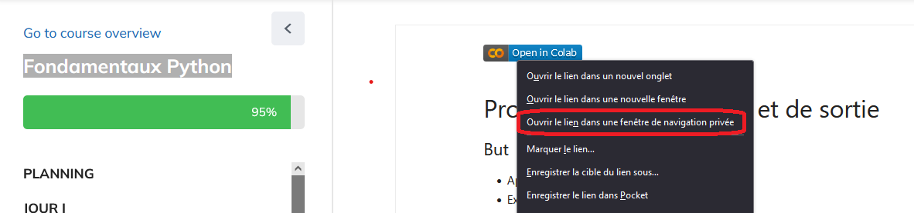
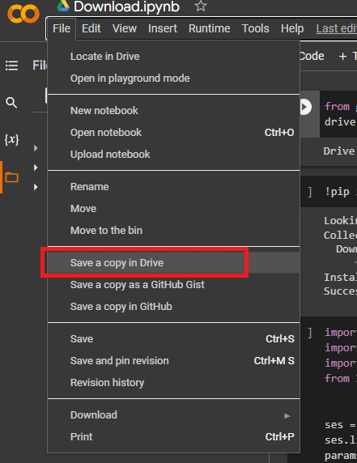

# Comment sauvegarder depuis colab sur github et rendre les assignements dans le github classrooms

-   Ouvrir le colab notebook dans une nouvelle fenêtre privée.

-   Partir dans fichier -> Enregistrer une copie dans drive .( Se connecter à son compte google, si vous n' êtes pas encore connecter ).

-   Faire les modifications nécessaire  dans le notebook .
-   Partir dans fichier -> Télécharger  -> Télécharger  le fichier .ipynb

https://classroom.github.com/a/gej_rcJx

APres avoir telecharger les Markdowns, 

Acceder au lien https://classroom.github.com/a/gej_rcJx

![[Pasted image 20230227123552.png]]

Et choisissez vos nom.

Il faut accepter le devoir

![[Pasted image 20230227123643.png]]

Vous allez avoir cette page
![[Pasted image 20230227123806.png]]
Il faut passionter quelque minutes, le temp que vos compte soit créer.

Apres queleque instants, actualiser la page

![[Pasted image 20230227123933.png]]

Vous allez voir un lien de devoir github

Vous cliquez sur le lien

Vous accedez au jour du notebook, puis vous cliquez 

![[Pasted image 20230227124236.png]]

Vous cliquez sur "Add file", puis Upload files.
Et vous uploadez les notebook.

![[Pasted image 20230227124251.png]]

Vous cliquez sur "Choose your files", et vous selectionnez les notebooks à uploader.

![[Pasted image 20230227124532.png]]

Et finalement, vous cliquez sur "Commit changes"
