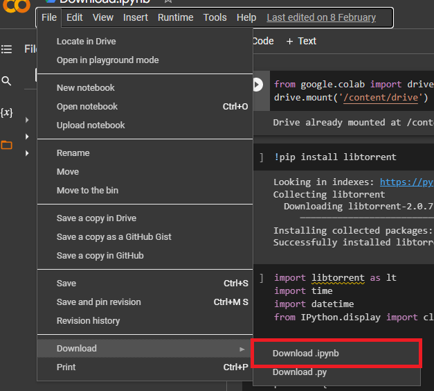

# Comment sauvegarder depuis colab sur github et rendre les assignements dans le github classrooms

-   Ouvrir le colab notebook dans une nouvelle fenêtre privée.
-   Partir dans fichier -> Enregistrer une copie dans drive .( Se connecter à son compte google, si vous n' êtes pas encore connecter ).

-   Faire les modifications nécessaire  dans le notebook .
-   Partir dans fichier -> Télécharger  -> Télécharger  le fichier .ipynb

